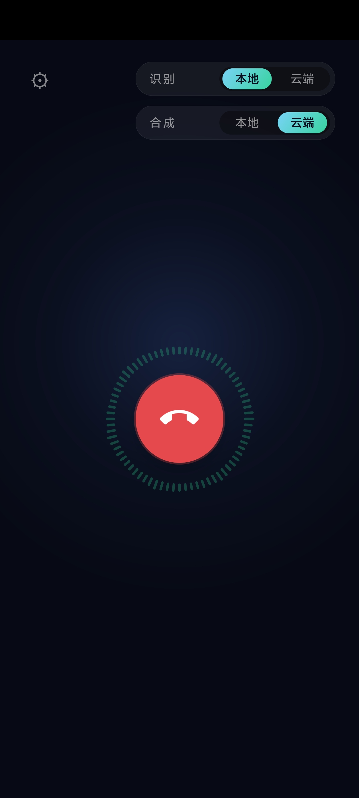

# realtime-voice-agent

全双工实时语音 Agent：可以**随时打断**（barge-in）的电话式语音对话系统。从"用户说完最后一个字"到"agent 开始出声"的延迟预算 **p95 ≤ 1200ms / p50 ≤ 800ms**，每个环节的耗时都有落盘的分解报告。

不依赖任何全家桶语音框架（LiveKit Agents / pipecat 等），整条流式管线手写；ASR / LLM / TTS 全部面向接口编程，云端 API 与本地开源模型可**独立切换、实时生效**。



## 特性

- **全双工 + barge-in**：agent 说话中途开口，200–400ms 内静音并开始聆听；旧音频一个字都不泄露（gen_id 代际竞态控制）
- **流式流水线**：VAD endpointing → 流式 ASR → LLM token 流 → 从句级分句 → 流式 TTS → 播放，逐环节流水线并行
- **延迟可观测**：每回合 7 个阶段时间戳落盘 JSONL，`p50/p95/p99` 分解瀑布报告，哪段超预算一眼可见
- **ASR/TTS 云端 ↔ 本地独立切换**：火山引擎 / Deepgram（云端）与 sherpa-onnx（本地 CPU/GPU）任意混搭，Web 页面和安卓 App 上有开关，**下一回合即生效、通话不中断**
- **三种客户端**：本地麦克风、Web 浏览器（拨通/挂断 + 频率波纹动效）、安卓 App（同界面）

## 架构

```
音频入（sounddevice / WebSocket / 安卓 AudioRecord）
   → VAD（Silero ONNX，逐 32ms 窗）
   → Streaming ASR（partial / final 事件流）
   → TurnManager（状态机：IDLE / USER_SPEAKING / PROCESSING / AGENT_SPEAKING）
        → LLM 流式生成（token 流 → 分句器 → 逐从句送出）
        → Streaming TTS（音频 chunk 流）
   → 播放层（jitter buffer，支持 flush 立即静音）
Instrumentation 贯穿全程：每个阶段边界打时间戳，按回合聚合出延迟报告。
```

核心管线只处理 **16kHz PCM16 mono**，所有格式转换都在 transport/provider 边界内完成。

## 快速开始（本地）

环境：Python 3.10+（推荐 conda），本地麦克风对话**必须戴耳机**（否则 agent 自己的声音会触发 VAD 自打断）。

```bash
conda create -n py310 python=3.10 -y
conda activate py310
pip install -r requirements.txt
```

下载模型（VAD 必下；本地 ASR/TTS 模型仅在使用本地栈时需要）：

```bash
# Silero VAD（~2MB）→ models/silero_vad.onnx
# https://github.com/snakers4/silero-vad 的 onnx 模型文件

# 本地 ASR（streaming zipformer 中英双语）→ models/sherpa-asr-bilingual-zh-en/
# 本地 TTS（VITS 中文女声）→ models/vits-zh-hf-fanchen-C/
# 均在 huggingface.co 的 csukuangfj 仓库下，用 huggingface_hub.snapshot_download 拉取
```

配置 `.env`（已 gitignore）：

```bash
KIMI_API_KEY=sk-...          # LLM（必需）
VOLCENGINE_API_KEY=...       # 云端 ASR/TTS（用云端时需要）
DEEPGRAM_API_KEY=...         # 云端 ASR 备选
```

选择 provider：编辑 `configs/local.json` 的 `providers.asr / llm / tts`（`sherpa`=本地，`volcengine`/`deepgram`=云端），ASR 与 TTS 可独立混搭。

运行：

```bash
# 本地麦克风全双工对话（戴耳机！）
python -m voice.duplex --config configs/local.json

# Web 应用（默认 6789 端口，浏览器打开 http://localhost:6789）
python -m voice.web_server --config configs/local.json

# 查看某次会话的延迟分解报告
python -m voice.metrics report reports/<session>.jsonl
```

## Web 应用与安卓 App

**Web**：`python -m voice.web_server` 后浏览器打开即进入通话界面——拨号键拨通/挂断，通话中显示 72 根环形频率波纹（用户=青绿、agent=蓝紫），右上角「识别/合成 × 本地/云端」开关实时切换 provider。注意：浏览器 `getUserMedia` 仅在 localhost 或 HTTPS 下可用，手机访问需配 HTTPS（见部署一节）。

**安卓**：源码在 `android/`（原生 Kotlin，无 AndroidX，仅 OkHttp，minSdk 26）。APK 不放在仓库里，从 **GitHub Releases** 下载；自行构建：

```bash
cd android && ./gradlew assembleDebug
# → app/build/outputs/apk/debug/app-debug.apk
```

App 左上角 ⚙ 填服务器地址（`主机IP:6789`），右上角同样有本地/云端切换开关。安卓走设备硬件 AEC，扬声器通话即可。

## 服务器部署

### 配置需求

| 部署形态 | 最低配置 | 说明 |
|---|---|---|
| 纯云端 API 版（ASR/TTS 走火山/Deepgram） | 1 核 2G，无 GPU | 服务器只做 VAD + 转发 + 状态机，负载很低 |
| 本地 ASR+TTS 版（sherpa-onnx） | 4 核+ CPU、4G+ 内存，无 GPU 要求 | 模型文件 ~700MB；多核 CPU 实时性已足够 |
| 本地 ASR+TTS + GPU（可选） | 任意 NVIDIA GPU（CUDA 12.x） | 换装 `sherpa-onnx-gpu`，TTS 首音频更快 |

**常见问题：为什么服务器上 `nvidia-smi` 看不到显卡占用？两个模型都在 CPU 跑吗？**
是的。`requirements.txt` 装的是 sherpa-onnx 的 CPU 版 wheel，ASR 和 TTS 两个模型都在 CPU 上推理——这两个模型很小，多核 CPU 跑实时绰绰有余（实测 ASR 关流即定稿、TTS RTF≈0.15），所以默认没启用 GPU，显卡占用自然是零。想用 GPU：安装 GPU 版 `pip install sherpa-onnx-gpu`（依赖 CUDA 12.x + cuDNN 9），再把 `configs/local.json` 里 `sherpa_asr.provider` / `sherpa_tts.provider` 改成 `"cuda"` 即可。

### 部署步骤

```bash
# 1. 拷贝代码、configs/、web/、models/、.env 到服务器（如 /opt/voice-agent）
# 2. 建环境
conda create -n py310 python=3.10 -y && conda activate py310
pip install -r requirements.txt

# 3. 生成自签 HTTPS 证书（手机浏览器用麦克风必须 HTTPS）
./deploy/gen_cert.sh <服务器IP>     # 生成 certs/cert.pem + key.pem

# 4. 放行端口并启动
ufw allow 6789/tcp && ufw allow 6790/tcp
./deploy/start.sh        # 一键启动（幂等）；./deploy/stop.sh 停止
```

启动后**单进程双监听**：`6789` 明文 HTTP/WS（安卓 App、局域网）、`6790` 自签 HTTPS/WSS（手机浏览器入口，检测到 `certs/cert.pem` 自动开启）。手机浏览器首次访问 `https://<服务器IP>:6790` 点「继续前往」信任一次证书即可。日志在 `reports/server.log`。

> 提示：境内服务器 80/443 入向通常被封（无 ICP 备案），所以用高位端口 + 自签证书，不要折腾 Let's Encrypt。

## 接入自己的 API

`.env` 里三个 key 对应三家 provider，**LLM 必须配，ASR/TTS 按你选云端还是本地决定**：

- **Kimi（LLM）**：代码走 OpenAI 兼容接口，`voice/llm/kimi.py` 里改 `base_url` / `model` 就能换成任何 OpenAI 兼容的大模型（DeepSeek、OpenAI、Qwen 等）。当前默认 `https://api.kimi.com/coding/v1` + `kimi-for-coding-highspeed`。
- **火山引擎（云端 ASR/TTS）**：火山引擎控制台 → 语音技术，开通「语音合成大模型」（resource_id 默认 `seed-tts-2.0`）和流式语音识别（默认 `volc.seedasr.sauc.duration`），创建 API Key 填入 `.env`；音色、resource_id 可在 `configs/local.json` 的 `volcengine` / `volcengine_asr` 段修改。
- **Deepgram（云端 ASR 备选）**：官网注册即有免费额度。

**想接别家 ASR/TTS/LLM？** 仓库只内置了上面几家，但接入点很薄：照 `voice/asr/base.py` / `voice/tts/base.py` / `voice/llm/base.py` 里的 Protocol 写一个实现，再到对应 `__init__.py` 的工厂函数注册即可，核心管线零改动。最快的做法是让 AI 编程助手（如 Kimi Code）照着现有的 `volcengine.py` / `deepgram.py` / `kimi.py` 仿写一个——每个实现都只有一两个文件。

## 延迟基准复现

不依赖真人说话，用固定录音回放跑 bench：

```bash
python scripts/make_20turn_wav.py                                    # 生成 20 回合标准测试音频
python -m voice.duplex --config configs/local_bench.json \
    --file reports/test_20turn.wav --no-play                         # 回放跑 bench
python -m voice.metrics report reports/<最新>.jsonl                   # 输出分解瀑布
python scripts/check_web.py                                          # Web 链路端到端回归
```

实测（20 回合）：云端栈 TOTAL p50=p95=**332ms**；本地栈 ASR 段更优（p50=0）但 TTS 段偏慢（CPU 整句合成），当前瓶颈为 Kimi TTFT ~0.9–1.2s。

## 目录结构

```
voice/
├── transport/      # local_sounddevice / wav_file / web_ws
├── vad.py          # Silero VAD 封装，speech_start / speech_end 事件
├── asr/            # ASR 接口 + deepgram / volcengine / sherpa / mock
├── llm/            # LLM 接口 + kimi / mock + 从句分句器
├── tts/            # TTS 接口 + volcengine / sherpa / mock
├── turn_manager.py # 全双工状态机 + gen_id 竞态控制（项目核心）
├── player.py       # jitter buffer 播放，支持 flush
├── duplex.py       # 本地麦克风全双工入口
├── web_server.py   # Web 应用服务端（aiohttp，单进程双监听）
└── metrics.py      # 打点、JSONL 落盘、延迟瀑布报告
web/                # 浏览器通话界面（原生 JS + AudioWorklet）
android/            # 安卓 App（Kotlin，APK 走 GitHub Releases）
configs/            # provider 选择、延迟预算、endpoint 参数
deploy/             # 服务器一键启停脚本 + 自签证书生成
scripts/            # 测试音频生成与端到端回归
reports/            # 会话延迟报告（gitignore）
```

## 设计要点（为什么不是"三个 API 调用"）

三个 API 串行调用得到的是 5–10 秒延迟、不能打断的语音问答脚本；本项目写的是把它们变成一条**可打断、可测量、低延迟的实时流水线**所需的全部工程：流式分句、VAD 轮次判定、barge-in 竞态控制（gen_id 铁律）、三套平台的回声消除、逐环节延迟打点。详见仓库讨论与 `voice/turn_manager.py` 注释。
